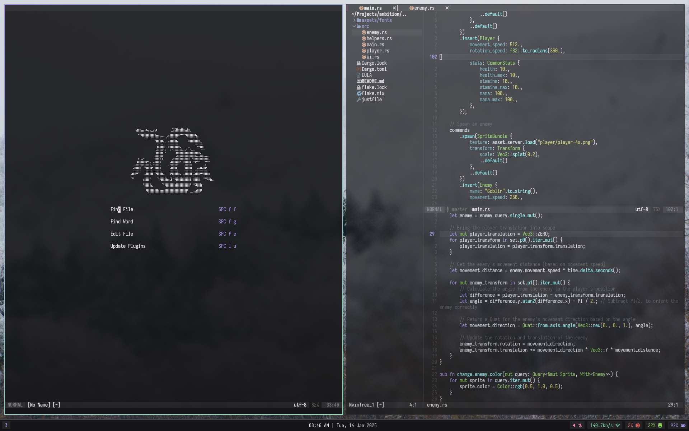

# radiant.nvim
`radiant.nvim` is a fast and minimal Neovim configuration framework; it aims to:

- Provide a solid base for *your* own configuration
- Help to make tailoring the Neovim experience simple and quick
- Create a consistent text editing experience for various common formats and files 
- [Be beautiful!](https://git.devraza.duckdns.org/devraza/kagayaki.nvim)

> **Keep in mind that this configuration isn't complete. Development has a long way to go before I can even say the above is true**.

> For the time being, installing packages must be done externally (I do it via my NixOS home-manager configuration). I'll turn this configuration into a flake for better accessibility when I feel the need to - though anyone reading this is welcome to request this happen sooner.

## Screenshots

This project is in its early stages of development. I consider it to produce a functional text editor and development environment, but it still lacks a lot of features and isn't very mature. Stay tuned!

## Notes in Neovim
This configuration has integrated support for [Neorg](https://github.com/nvim-neorg/neorg) by default - I recommend you check the official repository out if you intend to write notes in Neovim.
